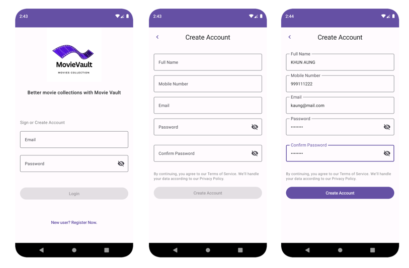
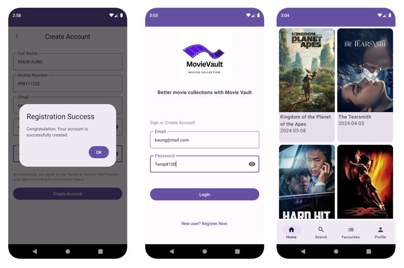
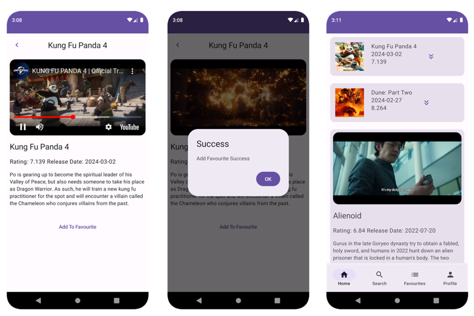
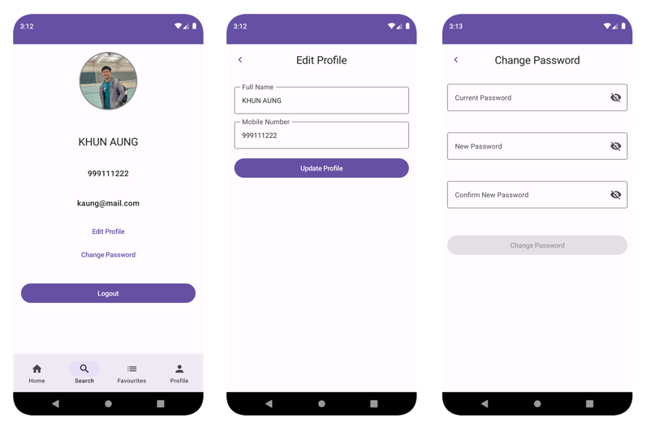
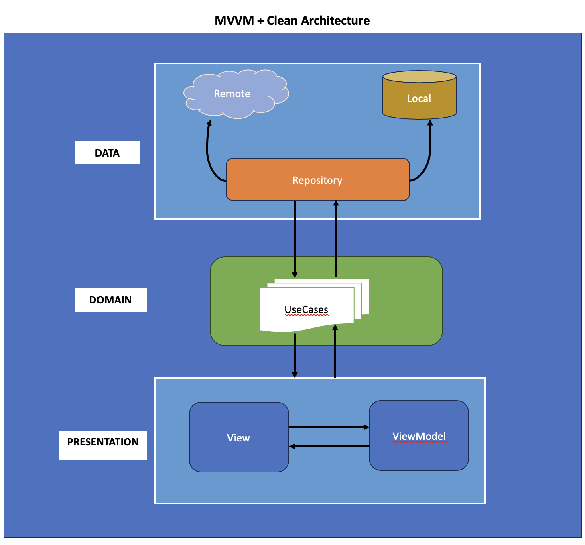

# **Movie-Vault (Movie Collection System)**

**Project Title:** Movie-Vault (Movie Collection System)

A native android app developed with Jetpack Compose technology. The application facilitates user interactions such as registration, login, browsing movie collections, viewing movie trailers, and saving favorites. It is seamlessly integrated with a RESTful backend web service.

* Android mobile application
* Jetpack Compose for UI
* Retrofit for API integration
* Coroutine for asynchronous programming
* LiveData and MVVM for data management and architecture
* Kotlin programming language

## Some features and UI Flow

### **Login & Create User Account**

 

### **Create User Account/ Login Success & Home Screen**

 

### **Seeing Movie Trailer & Add to Favourite**

 

### **Profile & Edit**

# About the Project

<b>MovieVault-Clean</b> is a sample project showcasing a modern approach to Android app development. It integrates widely-used Android tools and demonstrates best practices by leveraging a cutting-edge tech stack, including Jetpack Compose, Kotlin Flow, and Hilt.

## Tech Stacks

- [Kotlin](https://kotlinlang.org/) 100% coverage

- [Compose](https://developer.android.com/jetpack/compose)
    - [Material](https://developer.android.com/jetpack/androidx/releases/compose-material) - Build
      Jetpack Compose UIs with ready to use Material Design Components.
    - [Foundation](https://developer.android.com/jetpack/androidx/releases/compose-foundation) - Write
      Jetpack Compose applications with ready to use building blocks and extend foundation to build your
      own design system pieces.
    - [UI](https://developer.android.com/jetpack/androidx/releases/compose-ui) - Fundamental
      components of compose UI needed to interact with the device, including layout, drawing, and input.
    - [Glide](https://bumptech.github.io/glide/int/compose.html) - A fast and efficient image
      loading library for Android focused on smooth scrolling (Google).

- Dependency Injection (DI)
    - [HILT](https://developer.android.com/training/dependency-injection/hilt-android) is used for Dependency Injection as a wrapper on top of [Dagger](https://github.com/google/dagger).

      Most of the dependencies are injected with `@Singleton` scope and are provided within the `FoodMenuApiProvider` module.

      For ViewModels, we use the out-of-the-box `@HiltViewModel` annotation that injects them with the scope of the navigation graph composables that represent the screens.
      -You can also use [Koin](https://insert-koin.io/docs/quickstart/android/) -Koin provides a easy and efficient
      way to incorporate dependency injection into any Kotlin application.

- Others
    - [Retrofit](https://square.github.io/retrofit/)  for networking
    - [OkHttp-Logging-Interceptor](https://github.com/square/okhttp/blob/master/okhttp-logging-interceptor/README.md)  -
      Logs HTTP request and response data.
    - [Flow](https://developer.android.com/kotlin/flow) - Flows are built on top of coroutines and
      can provide multiple values.
    - [Material Design](https://material.io/develop/android/docs/getting-started/) - Build awesome
      beautiful UIs.
    - [Coroutines](https://github.com/Kotlin/kotlinx.coroutines) - Library Support for
      coroutines,provides runBlocking coroutine builder used in tests.
    - [Gson](https://github.com/google/gson) - A modern JSON library for Kotlin and Java.
    
- Youtube Player (android-youtube-player) 
    - [Youtube Player (android-youtube-player)](https://pierfrancescosoffritti.github.io/android-youtube-player/) is a stable and customizable open source YouTube player for Android. It provides a simple View that can be easily integrated in every Activity/Fragment.

## Architecture

The <b> MVVM (Model-View-ViewModel) Clean Architecture </b>pattern has been implemented in this application, with Kotlin as the development language. Clean Architecture promotes separation of concerns, enhancing both maintainability and testability. Integrating MVVM with Clean Architecture organizes the application into distinct layers:

* Presentation Layer
* Domain Layer
* Data Layer

This layered structure simplifies development and testing, making the application more robust and scalable.

## **Backend Project (MovieVault Webservice App)**

The backend API for this project is built using **Spring Boot**, with **Spring Security** handling user authentication and **Spring Data JPA** managing data persistence. Additionally, **MySQL** is utilized as the database to ensure efficient and structured data management. You can view the sample project on GitHub [here](https://github.com/ksmaprince/MovieValut-WebServices).

### Designed and Developed By [KHUN AUNG](https://www.khunaung.me/).

